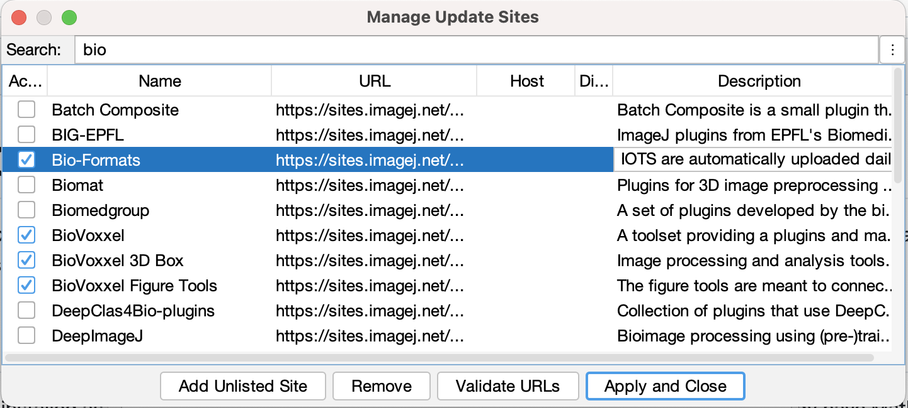
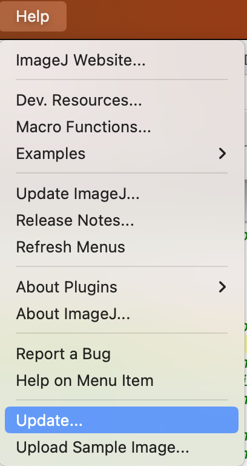
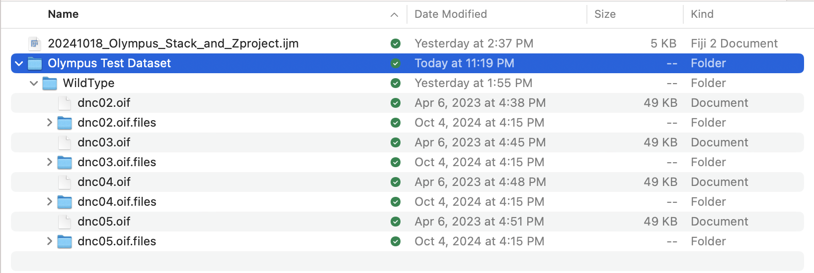
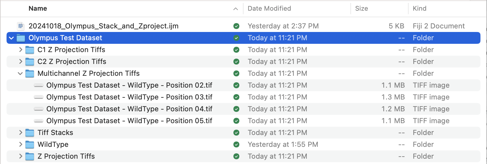

## Summary

This Fiji Macro serves to convert.oif files to tiff stacks and Z
projection tiffs for 1 or 2 channel images.

## Requirements

It requires the use of the ‘Bio-Formats macro extensions’ plugin which
can be obtained from the Help\>Update..\>Manage Update Sites. The Macro
should be run after setting the Language to ImageJ Macro
 
 
 
 
## Inputs

The required inputs are the Dataset Directory and the type of
Z-projection to use.

The Dataset directory (Olympus Test Dataset in the example) should contain individual subdirectories for each
genotype being analyzed. Each genotype subdirectory should in turn
contain the .oif files and their associated folders. The Dataset
directory will be requested once the macro is run.

The type of Z-projection should be one of "Sum Slices", "Average
Intensity", "Max Intensity", "Min Intensity", "Standard Deviation", and
"Median". We usually use a Maximum Intensity projection ("Max
Intensity") but it seems that Sum Intensity (“Sum Slices”) or average
intensity ("Average Intensity") might be more suitable given the example
datasets that Jeremy gave me. This value is changed within the macro
itself (the *projection_type* variable).

## Outputs

### Output Directories for 1 Channel Images

Two directories will be created within the Dataset Directory, the ‘Tiff
Stacks’ directory which will contain the full Tiff Stacks and the ‘Z
Projection Tiff’ directory which will contain the Z projected tiffs.

### Output Directories for 2 Channel Images

Four directories will be created within the Dataset Directory, the ‘Tiff
Stacks’ directory which will contain the full Tiff Stacks, the
‘Multichannel Z Projection Tiff’ directory which will contain the
Z-projected 2 channel Tiffs, the ‘C1 Z Projection Tiff’ directory which
will contain the Z projection tiffs of only channel 1 and the ‘C2 Z
Projection Tiff’ directory which will contain the Z projection tiffs of
only channel 2.

### Output Filenames

The output filenames in each directory are identical. They are of the
format

\[Dataset directory name\] – \[Genotype directory name\] – Position
\[Number in .oif name\].tif

Files in this naming convention can be directly used by *WormSNAP* so
any of the Z Projection Tiff directories can be used as an input to
*WormSNAP*.
