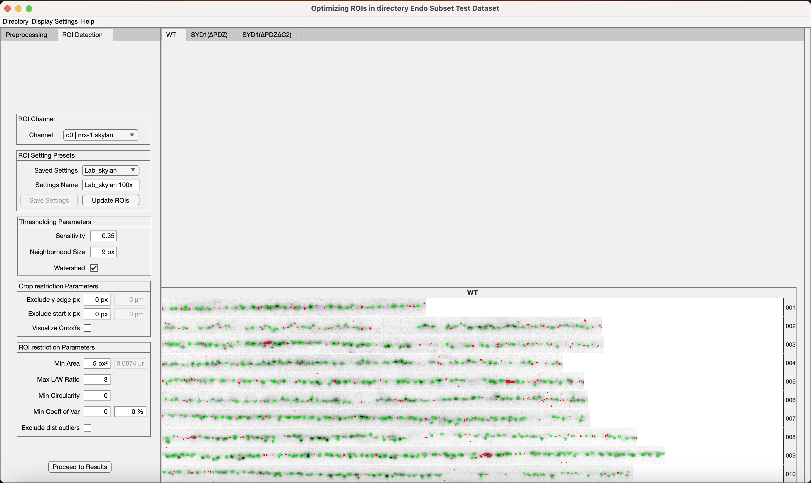
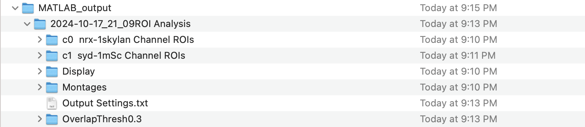
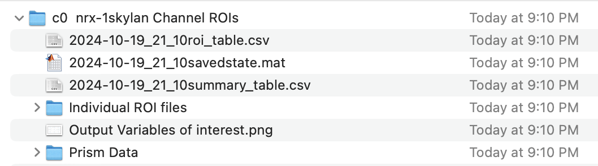
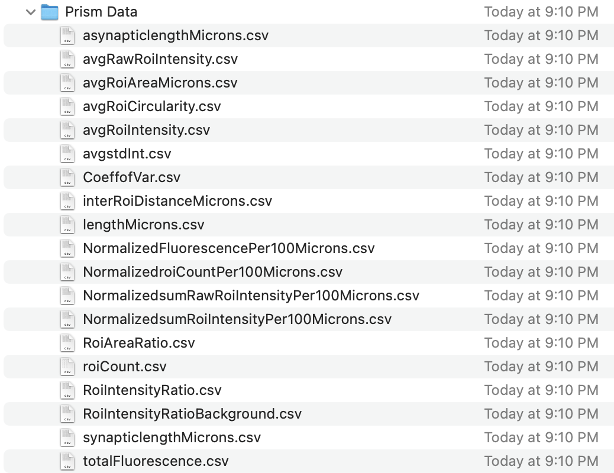

# WormSNAP Quick Guide

*WormSNAP (Worm SyNapse Analysis Program)* is a software designed to perform
code-free fluorescent puncta detection in *C. elegans* confocal 1- and
2-channel images based on a local means thresholding algorithm.

 [Installation](#installation) | [Data Naming Guide](#data-input-format) | [Guide](#guide-to-wormsnap) | [Outputs](#outputs) | [Display Settings](#display-settings)

# Installation

## System Requirements

WormSNAP was coded in MATLAB R2022a and thus shares the same
requirements as it:

<table>
<colgroup>
<col style="width: 33%" />
<col style="width: 33%" />
<col style="width: 33%" />
</colgroup>
<thead>
<tr>
<th><h3 id="component">Component</h3></th>
<th><h3 id="windows">Windows</h3></th>
<th><h3 id="mac">Mac</h3></th>
</tr>
</thead>
<tbody>
<tr>
<td>Operating System</td>
<td><p>Windows 11</p>
<p>Windows 10 (version 1909 or higher)</p>
<p>Windows Server 2019</p></td>
<td><p><strong>Minimum</strong></p>
<p>macOS Monterey (12) macOS Big Sur (11.6) macOS Catalina
(10.15.7)</p></td>
</tr>
<tr>
<td>Processor</td>
<td><p><strong>Minimum</strong></p>
<p>Any Intel or AMD processor x86-64 with 2+ cores</p>
<p>Any M-series Chip</p>
<p><strong>Recommended</strong></p>
<p>Any Intel x86-64 or AMD processor with four logical cores and AVX2
instruction set support</p></td>
<td><p><strong>Minimum</strong></p>
<p>Any Intel x86-64 processor with 2+ cores</p>
<p>Any M-series Chip</p>
<p><strong>Recommended</strong></p>
<p>Any Intel x86-64 processor with four logical cores and AVX2
instruction set support</p></td>
</tr>
<tr>
<td>RAM</td>
<td><p><strong>Minimum</strong></p>
<p>4 GB</p>
<p><strong>Recommended</strong></p>
<p>8+ GB</p></td>
<td><p><strong>Minimum</strong></p>
<p>4 GB</p>
<p><strong>Recommended</strong></p>
<p>8+ GB</p></td>
</tr>
<tr>
<td>Storage</td>
<td><p>5-8 GB (Matlab App)</p>
<p>2.5 GB (Standalone App with Runtime)</p></td>
<td><p>5-8 GB (Matlab App)</p>
<p>2.5 GB (Standalone App with Runtime)</p></td>
</tr>
<tr>
<td>Graphics</td>
<td>Hardware accelerated graphics card supporting OpenGL 3.3 with 1GB
GPU memory</td>
<td>Any Mac able to run macOS Catalina has a GPU able to run MATLAB</td>
</tr>
</tbody>
</table>


## Getting the WormSNAP App

WormSNAP can be either installed as a matlab app or as a standalone
desktop app. 

To install as a MatLab  app:
> You must have Matlab installed (minimum of Matlab 2022a) **with the following toolboxes**:
  >- Image Processing and Statistics toolbox
  >- Machine learning toolbox
>    
> The Matlab app is packaged in: WormSNAPApp.mlappinstall, simply download and run the .mlappinstall file.

To install as a standalone desktop app:
>  Download the appropriate file (note that if it the first time you are using a Matlab Runtime based standalone app, it will have to download the appropriate runtime files too):
  >- For PCs, download the WindowsIntaller.zip and run the installers
  >- For Macs, download MacOSIntaller.zip and run the installers  

For more on system requirements, please check the full documentation. 

Note: You will also need to have FIJI with the Bioformats plugin
installed if your files are not in a .tiff format.

***

# Data input format

WormSNAP uses a directory of 1- or 2-channel maximum intensity Z-projected tiff files as
input. The filename convention for these tiff files is:
<p align="center">
[Dataset Name] – [Genotype Name] – Position [WormNumber].tif
</p>

For example: 
<p align="center">
10212024.sld – PTK500 – Position 12.tif
</p>

Where:

>**Dataset Name** is the name of the dataset: you can use any text except
>‘ – ‘ (space hyphen space)

>**Genotype Name** is the name of the genotype or treatment condition: again, you can use any text except ' - ' (space hyphen space) 

>**WormNumber** is the sample number in digits. Repeats are not expected within a genotype (i.e. only a single position 12 recorded for the PTK500 genotype, but another position 12 could be recorded for a different genotype like PTK501) 

Note: If your files are in another format, please check the Formats
folder for FIJI Macros that can be used to convert your files into the
appropriate format. Files will not load into WormSNAP if they do not follow these naming conventions!

# Guide to WormSNAP


## Getting Started


Launch the WormSNAP application from the MATLAB App Toolstrip or the
application file. This will open a folder selection dialog box (see image at right). Navigate your way to your
directory containing the tiffs of interest and click open/select folder. 

The tiffs will be loaded into the app’s Display Panel (see below, right side), with each genotype listed into
a different tab. 

>If there is an issue loading your files, the program should provide a reason (it is usually file naming, occasionally with just one file named incorrectly). 


If you want to select another directory, you can click on the Directory menu and then the Select New Directory submenu. 
This will prompt you with the folder selection dialog again. 

## Preprocessing Tab


In the Settings Panel (left), the first tab available is the Preprocessing Tab. 

### Channel Naming Panel
> Edit the channel name as needed. e.g. change C1 to CLA-1::GFP
>
> If there are two channels, you can switch between the channels using the
‘channel list’ dropdown. You can save the name(s) as a preset by clicking 'Save Set'

### Genotype Renaming Panel
> Rename Genotypes as needed. (e.g. "PTK500 no treatment" to "CTRL")
> 
> Click on the Original Genotype name on the left list and type in the new name in the input
field next to the ‘New Genotype Name’, and then press Enter.
> 
> The New Name should then be visible in the ‘Renamed Genotype’ list. These will be
used as headers when calculating the different output metrics.

### Resolution Panel

> The Resolution panel is used to specify the Resolution of the image (in px/µm).
>
> The default option is ‘Automated’ which will check the tiff files for the information and use it if the resolution is available (and consistent across all images included).
>
> The Manual option allows you to type in your own values and the other options
>
> The 100 X Mag, 63 X Mag, 2.5 X Mag options offer common default values for objectives in use in the Kurshan lab (however beware that the numerical apertures will differ between different setups, so the effective resolution of other 100 X Mag objectives will not necessarily be the same).
>
> If no value is specified, the resolution will be set to 0 and all output variables normalized to pixel size in microns (e.g. 'ROICountper100µm') will instead be normalized to the pixels.
> 

#### Once you are finished with preprocessing, click the ‘Preprocessing Completed’ button at the bottom to load the ROI detection tab.

## ROI Detection Tab


### ROI Channel Panel
> Select which channel to detect ROIs in. 

### ROI Settings Presets Panel

> To detect ROIs either:
> - select one of the presets in the Saved Settings Dropdown 
> - use your own combination of settings (which you will specify in the dialogs below)

Clicking ‘UpdateROIs’ will initiate the program in identifying ROIs based on the settings chosen.
> 
> If you are determining a new combination of settings in the dialogs below, you can iteratively make changes and click UpdateROIs to check them on the images at the right.
> 
You can save new settings by typing a name in the Settings Name field and then clicking ‘Save Settings’. 

### Thresholding Parameters Panel 

This panel contains the 3 ROI thresholding settings for the local mean
thresholding algorithm.

> - Sensitivity: ranges from 0-1 and is a measure of how likely a given
pixel is to be thresholded as signal with higher values leading to
thresholding more pixels as foreground.
>
> - Neighbhorhood Size: refers to the number of neighboring pixels used
to calculate the threshold for a given pixel. Its values can only be odd
integers as it includes the pixel of interest.
>
> - Watershed: an option that applies a watershed transform to the ROIs,
which allows for separating close by puncta that get thresholded
together.

### Crop Restriction Parameters Panel 

This panel contains restriction parameters that allows users to restrict
ROIs based on their location within the crop.

> - The ‘Exclude y edge px’ option excludes any ROIs that are a within a
given number of pixels away from the top and bottom edges of the crops.
>
> - The ‘Exclude x start px’ option excludes any ROIs that are within a
given number of pixels from the start of the image. If the resolution is
not 0, these values are also calculated in microns.

The ‘Visualize Cutoffs on crops’ checkbox allows users to see where the cutoffs are placed. Solid lines are used for applied settings and dotted lines for current settings. These are assumed to apply identically to each channel.

### ROI Restriction Parameters Panel 

This panel contains restriction parameters that allows users to restrict
ROIs based on their individual properties.

> - Min Area excludes any ROIs with a given area or less in
pixels<sup>2</sup> (with conversion to µm<sup>2</sup> provided at right if resolution
\>0).
>
> - Max L/W ratio excludes any ROI with a given maximum length/width
ratio or higher. Here, the length/width ratio refers to the ratio of the
maximum ferret diameter (largest dimension/major axis for an ellipse) to
the ratio of the minimum ferret diameter (smallest dimension/minor axis
for an ellipse)) or higher.
>
> - Min Circularity excludes any ROIs with a circularity below the
specified value. Circularity ranges from 0 (perfect line) to 1(perfect
circle). Not recommended for small ROIs (such as 3x3 squares), as the
computed circularity can be greater than 1.
>
> - Min Coeff of Var excludes any ROIs with a coefficient of variance
above a given value. The coefficient of variance or relative standard
deviation is the ratio of the standard deviation of the pixel
intensities to the mean of pixel intensities. This measure can be used
to exclude background signal that has relatively constant intensities.
>
> - Exclude dist. outliers option, when selected, excludes any ROI
whose distance to their nearest neighbor is three scaled median
deviations away from the median distance to the nearest neighbor for the
ROIs in each crop. (We use exclude dist. outliers only in very specific cases when running spatial analyses)




### Making Exclusions 

> If you think any crops should be excluded from analysis, simply left-click on the crop and it will become invisible and excluded from further analysis. Common examples for using this option are when the sample moved during collection and the image is out-of-focus or smeared.
>These Exclusions can be saved using the Directory menu and reused for further analysis.


#### Once you have detected ROIs in all the channels, the ‘Proceed to Results’ button is enabled. Clicking on this brings you to the final tab, the Results Tab.

## Results Tab


### ROI Display Panel

Here, you can view the crop and ROIs in various configurations,

> The ‘Crop Channel’ dropdown selects the channel of the crop.
>
> The ‘ROI Visibility’ dropdown selects which ROIs are overlaid on the
crops:
>  - **All ROIs:** shows all thresholded ROIs
>  - **Restricted ROIs:** shows only ROIs that satisfy the restriction parameters
>  - **No ROIs:** only displays crops and shows no ROIs.
>
> The ‘ROI Channel’ dropdown allows you to select between channels to display.
>  - If you pick the ‘Both Channels’ option when looking at 2 channel images, the restricted ROIs of the first channel will be shown in green and those of the second channel in red.

### Intensity Normalization panel

> The Intensity Normalization panel lets you normalize the intensities of
your crops based on either:
> - a specific genotype (the values used will be the median minimum intensity and median maximum intensity of the genotype you select)
> - intensity value range you specify 

### Export Settings Panel

The Export Settings panel allows you to pick the types of output you
want.

> The ‘Create Prism files’ option creates ready for prism .csv files that
can be directly imported to prism or other plotting software. These are the files that contain data organized for further analysis! See [Prism Outputs](#Files-in-Channel-Prism-Data-folder) for information on the quantifications that are performed 
>
> The ‘Create Individual Crop Figures’ option creates individual .pdf
figures for each crop with overlays of the ROIs. 
>
> Selecting ‘Save Current Crop Display’ will save the current view shown
in the display panel as a .pdf file.
>
> Selecting ‘Create Crop Montage’ will create a montage of the crops for
each channel based on the selected Normalization. Note: This is not
currently recommended for Normalization across two channels.
>
> The ‘save analysis as a ‘.mat’ file will save a file which contains the
full analysis parameters if needed.
>
> Selecting ‘Calculate Overlap Metrics’ calculates metrics for overlap
between the ROIs in each channel. The selected Overlap Threshold is used
to calculate R1 and R2 (See Outputs for more details).

#### Once you are done making your selections, Click ‘Process All Crops’ to start analyzing the crops and associated ROIs.

# Outputs



> A ‘Matlab Output’ folder will be created in the directory containing the
tiff files the first time a dataset is analyzed.
>
> Each Analysis is saved within that folder as its own folder named
\[Datetime\]ROI Analysis.
>
> Each analysis folder contains an ‘Output Settings.txt’ file that
contains all the settings used for the analysis. It also contains 1
folder per channel named \[ChannelName\] Channel ROIs as well as three
other folders depending on the export settings chosen.

## Channel Folders



> Each Channel Folder contains two .csv files:
> - \[Datetime\]roi_table: contains the properties of every restricted ROI 
> - \[Datetime\]summary_table: contains the calculated variables for every crop as well as a png file called Output Variables of interest which contains boxplots of a few of the variables.

If the ‘Create Prism files’ option was checked: 
> a folder named Prism Data is included, which contains .csv files for different variables that
can be easily imported into Prism or other plotting software. See [Prism Outputs]([#Files-in-Channel-Prism-Data-folder]) for further information on the variables that are analyzed.

If the ‘Create Individual Crop Figures’ option was checked: 
> a folder named *Individual ROI files* is included which contains .pdf files
showing the ROIs for each crop. Note: These files can be opened in
illustrator or most figure making software.

If the ‘Save Analysis as .mat file’ option was selected:
> a file named \[Datetime\]savedstate will be included. This file can be opened in
matlab to access all the information of the analysis.

## Display Folder

The ‘Display’ folder is included if ‘Save Current Crop Display’ was
checked in export settings and contains .pdf files of the Display Panel
with the same combination of channel and ROI view chosen. 
> Only the current crops will be viewable, and crops from other genotypes are not saved

## Montages Folder

The ‘Montages’ folder is included if ‘Create Crop Montage’ was checked
in export settings and contains .pdf files of the crops with no ROIs
normalized as per the settings chosen in the Results Tab. 
> Note: This currently should not be used for 2 channel images.

## Overlap folder

The Overlap folder is included if ‘Calculate Overlap Metrics’ was
selected for a 2 channel image. The overlap threshold used is appended
to the name of the folder.

> This folder contains a csv file named \[Datetime\]summarytable which
contains:
> - the calculated colocalization variables for every crop
> - Overlap Metrics png file which contains boxplots of the colocalization
metrics.

If the ‘Create Prism files’ option was checked, a folder named Prism
Data is included which contains .csv files for the colocalization
metrics.

If the ‘Create Individual Crop Figures’ option was checked, a folder
named *Individual ROI files* is included, which contains .pdf files showing the ROIs for each crop. 
> In each file, the Restricted ROIs are shown overlaid on their respective channel, then the unique ROI areas
are shown for each channel and finally the unique ROIs based on the Overlap Threshold chosen are shown.

## Files in Channel Prism Data folder



**avgRawRoiIntensity.csv**

> Average of the Raw Intensity of the ROI pixels in each crop (no
background subtraction)

**avgRoiCircularity.csv**

> Average Circularity of the ROIs in each crop. Circularity ranges from 0
(perfect line) to 1 (perfect circle). Note that circularity can go above
1 for very small ROIs.

$`Circularity = \frac{4\pi Area}{{Perimeter}^{2}}(1 - \frac{1}{2r})`$
where $`r = \frac{Perimeter}{2\pi} + \frac{1}{2}`$

**avgRoiIntensity.csv**

> Average of the Intensity of the ROI pixels in each crop.

**avgstdInt.csv**

> Average Standard Deviation of pixel intensities in the ROIs in each
crop.

**CoeffofVar.csv**

> Average Coefficient of Variance of pixel intensities of ROIs in each
crop.

**RoiAreaRatio.csv**

> Ratio of the summed area of all ROIs found in each crop to the total area of
the entire crop.

**roiCount.csv**

> Number of ROIs in each crop (no normalization to length of crop)

**RoiIntensityRatioBackground.csv**

> Ratio of total ROI Intensity to that of the total background intensity
used to calculate the ROI intensity.

``` math
RoiIntensityRatioBackground = \frac{sumRawRoiIntensity}{sumRawRoiIntensity - sumRoiIntensity}
```

**RoiIntensityRatio.csv**

> Ratio of total Raw ROI intensity to that of total fluorescence of the
crop.

**totalFluorescence.csv**

> Total intensity of all pixels in the crop (not normalized to crop length)

#### For the parameters that rely on the dimensions of the crops, if a resolution is included, they will be calculated in microns (or per 100 microns) otherwise they will be calculated in pixels (or per 500 pixels).

**Asynapticlength(Microns/Pixels).csv**

> Calculated X Distance from start of the crop to the first ROI in pixels or microns.

**avgRoiArea(Microns/Pixels).csv**

> Average area of the ROIs in each crop (in microns or pixels, depending on whether resolution information was available)

**interRoiDistance(Microns/Pixels).csv**

> Average distance between an ROI and subsequent ROI based on their
weighted centroid (center weighted by pixel intensity values) position
in each crop.

**length(Microns/Pixels).csv**

> Length of crop.

**synapticlength(Microns/Pixels) .csv**

> Calculated X Distance from the first ROI to the last ROI in pixels or microns.

**NormalizedFluorescencePer(100Microns/500 Pixels).csv**

> Total Fluorescence of each crop normalized to 100 Microns distance (or 500 Pixels).

**NormalizedroiCountPer(100Microns/500 Pixels).csv**

> Number of ROIs in each crop normalized to 100 Microns (500 Pixels).

**NormalizedsumRawRoiIntensityPer(100Microns/500 Pixels) .csv**

> Sum of Raw intensity (no background subtraction) of all ROI pixels in each crop normalized to 100 Microns (500 Pixels).

**NormalizedsumRoiIntensityPer(100Microns/500 Pixels).csv**

> Sum of intensity of all ROI pixels in each crop normalized to 100 Microns (500 Pixels).

## Files in the Overlap Prism Data folder

There are 5 metrics calculated for channel colocalization purposes:
- [Pearson’s Correlation Coefficient]([#Pearson's'-colocalization-coefficients])
- [Manders’ Correlation Coefficients M1 and M2]([#Manders'-correlation-coefficients])
- [ROI Overlap Coefficients R1 and R2]([#ROI-overlap-ratios])

### Manders’ Colocalization Coefficients

**M1_c1roiAreaOverlapratio.csv**

Manders’ Colocalization Coefficient M1 is the fraction of signal
pixels in channel 1 that are also signal pixels in channel 2

``` math
M1 = \frac{\sum_{i}^{}{C1}_{i,coloc}}{\sum_{i}^{}{C1}_{i}}
```

Where:

> $`{C1}_{i} = 1`$ if pixel $`i`$ is thresholded as signal in Channel 1
> and $`{C1}_{i} = 0`$ otherwise
>
> $`{C1}_{i,coloc} = 1`$ if pixel $`i`$ is thresholded as signal in both
> channels and $`{C1}_{i,coloc} = 0`$ otherwise

**M2_c2roiAreaOverlapratio.csv**

Manders’ Colocalization Coefficient M2 is the fraction of signal
pixels in channel 2 that are also signal pixels in channel 1

``` math
M2 = \frac{\sum_{i}^{}{C2}_{i,coloc}}{\sum_{i}^{}{C2}_{i}}
```

Where:

> $`{C2}_{i} = 1`$ if pixel $`i\ `$is thresholded as signal in Channel 2
> and $`{C2}_{i} = 0`$ otherwise
>
> $`{C2}_{i,coloc} = 1`$ if pixel $`i\ `$is thresholded as signal in
> both channels and $`{C2}_{i,coloc} = 0`$ otherwise

### Pearson’s Correlation Coefficient

**PCC.csv**

Pearson’s Correlation Coefficient determines how linear the relationship
between two variables in this case the intensity in Channel 1 and
intensity in Channel 2 is.

``` math
PCC = \frac{\sum_{i = 1}^{n}{({C1}_{i} - \overline{{C1}_{n}})({C2}_{i} - \overline{{C2}_{n}})}}{\sqrt{\sum_{i = 1}^{n}{({C1}_{i} - \overline{{C1}_{n}})}^{2}\sum_{j = 1}^{n}{({C2}_{j} - \overline{{C2}_{n}})}^{2}}}
```

Where

>$`n`$ is the total number of pixels in the crop
>$`{C1}_{i}`$ is the intensity of pixel $`i`$ Channel 1
>$`{C2}_{i}`$ is the intensity of pixel $`i`$ Channel 2
>$`\overline{{C1}_{n}}`$ is the average intensity of all pixels in
Channel 1
>$`\overline{{C2}_{n}}`$ is the average intensity of all pixels in
Channel 2

### ROI Overlap Ratios

**R1_c1roiOverlapratio.csv**

The ROI Overlap Ratio R1 is the fraction of ROIs in channel 1 that have
a significant overlap with ROIs in channel 2, above a user-defined
Overlap Threshold. The Overlap Threshold is the minimum fraction of
pixel overlap that defines whether two ROIs are overlapping.

``` math
R1\  = \frac{\sum_{a}^{}{C1}_{a,coloc}}{N1}
```

Where:

> $`N1`$ is the number of ROIs detected in channel 2
>
> $`{C1}_{a,coloc} = 1`$ if ROI $`a`$ is considered to have significant
> overlap with ROIs in Channel 2 based on an Overlap Threshold of the
> percentage of its pixels thresholded as signal in Channel 2,
> $`{C1}_{a,coloc} = 0`$ otherwise

**R2_c2roiOverlapratio.csv**

The ROI Overlap Ratio R2 is the fraction of ROIs in channel 2 that have
a significant overlap with ROIs in channel 1, above a user-defined
Overlap Threshold. The Overlap Threshold is the minimum fraction of
pixel overlap that defines whether two ROIs are overlapping.

``` math
R2 = \frac{\sum_{b}^{}{C2}_{b,coloc}}{N2}
```

Where:

> $`N2`$ is the number of ROIs detected in channel 2
>
> $`{C2}_{b,coloc} = 1`$ if ROI $`b`$ is considered to have significant
> overlap with ROIs in Channel 1 based on an Overlap Threshold of the
> percentage of its pixels thresholded as signal in Channel 1,
> $`{C2}_{b,coloc} = 0`$ otherwise

# Display Settings


Display settings can be accessed by clicking the Display Settings option on the menu bar. 
These options allow you to customize the application's display to suit your needs.


**Number of Crops per Tab**


The Number of Crops per Tab Menu allows you to pick the maximum number of crops per tab. Lowering this number can improve display speeds at higher number of crops. The default is set at 50 based on test crops of under 30-50kb (per channel). Lower numbers might be needed for larger files.


**Change Crop Colormap**


This option allows you to change the colormap of the crops. The default option is "Inverted Gray" where low intensities are white and high intensities black. The Parula colormap has low intensities as blue and high intensities as yellow. The 'Other' Option opens the colormap editor, allowing you to choose from several preset colormaps or make your own. Note: The other option is not available in the standalone apps as of current release. 

**X axis Direction**


This option allows you to change the direction of the X-axis for the crops. The default 'Normal' option has the x-axis starting from the left of the crops while the 'Reverse' option has them starting from the left. The reverse option can be more useful when looking at DNC processes as it the aligns with the axon orientation in the worms.


**Change ROI Colors**

 


    

This option allows you to change the colors of the ROIs overlaid on the crops. The default is green | red which shows the restricted ROIs (aka ROIs that passed all the parameter restrictions) as green and the excluded ROIs (ROIs that were thresholded but failed to meet the parameter restrictions) as red. You can pick either the blue | red option or the 'other' option. If you select the 'Oher' option, you will be prompted by two list dialog boxes where you can choosed the ROI colors


  

**Change ROI Visibility**


  
This option cannot be changed in the menu but reflects the choice you make in the ROI detection tab.  

**Save Current Display Settings as Default**

Clicking this saves the current settings as defaults that will be used the next time you open the app.

**Restore Original Display Defaults**

Clicking this restores the current settings to the preset defaults.
 
